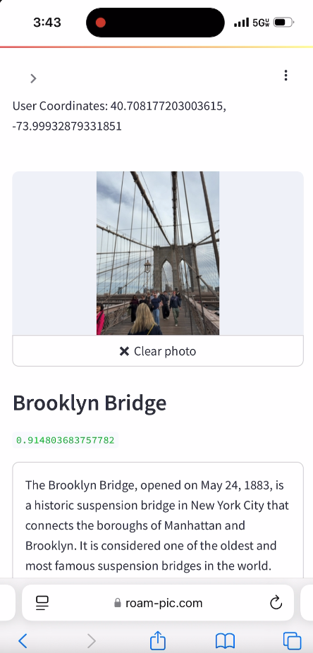

ROAM is an AI tour guide assistant that empowers users to learn about the world around them. The platform enables users to upload an image of a landmark, and receive instant information about its history and significance. From active travelers to passive wanderers, our mission is to empower individuals to learn in a simple and intuitive way that will help foster understanding, empathy, and global awareness!

# Mission Statement

Our world is becoming increasingly interconnected as technology continues to develop and improve. It is our collective job to continue teaching and learning about those with different backgrounds.

When traveling to or exploring a new destination, it is often difficult to learn about the culture, history, or significance behind interesting landmarks without the assistance of a tour guide or local expert. By combining image detection with retrieval augmented generation, ROAM brings the knowledge and charisma of local historians to the palms of travelers' hands. 

With image detection, users will first be able to confidently identify what surrounds them. Incorporating retrieval augmented generation then provides succinct summaries about historical significance and other relevant information for the user to learn from. This knowledge will help build stronger relationships across disparate communities and promote inclusivity.

# Product + Features

  

    <ul style="font-size: 1.1rem;">
      <li>Interactive and mobile-friendly website</li>
      <li>Geolocating</li>
      <li>Landmark Identification</li>
      <li>Landmark Identification Confidence</li>
      <li>Interesting information about the identified landmark</li>
    </ul>
  

  

    
  

# Demo
<video controls style="max-width: 100%; border-radius: 12px;">
  <source src="assets/video/demo.mp4" type="video/mp4">
  Your browser does not support the video tag.
</video>

# High Level System Architecture

ROAM’s architecture is fully deployed on AWS EC2 and Sagemaker Endpoints. The front end application is hosted on a secure domain (roam-pic.com), which is ran on an EC2 instance. Using a secure domain allows for users to access Streamlit safely on their phone via web-access and allows access to camera and location information. When users take a photo of a landmark, the photo is sent to our AWS Sagemaker endpoints, which include two computer vision models for landmark detection and a RAG model for historical retrieval. This is then shown back to the user on Streamlit. 

# About the Data

For landmark detection, we are using the [Google Landmarks v2 dataset](https://github.com/cvdfoundation/google-landmark?tab=readme-ov-file). It was filtered down from ~4.2 million to ~1.6 million images by researchers at Google. With over 81 thousand landmarks, this made the data much more suitable for training a high precision landmark identification model. Still, several instances remained where the main object in the image was not aligned with the image’s label.

To programmatically filter out these noisy images, a visual question answering model called BLIP is used. For every image in each class (landmark), BLIP identifies the main object in the image. The frequency of each unique BLIP label for each class is counted and only the images within a class with the most frequent BLIP label are kept.

# ML Architecture

# RAG Pipeline

Once the vision model identifies the landmark from the user-provided image, the RAG pipeline retrieves relevant information to simulate an interactive tour guide experience. Using a custom prompt that includes the landmark and any additional user-provided details, the system queries a RAG database containing curated data from UNESCO World Heritage Sites and relevant Wikipedia entries.

The UNESCO dataset includes over 1,000 landmarks across 168 countries and is highly regulated, with strict submission guidelines ensuring data quality. To enrich this, we dynamically append the top two Wikipedia entries for the identified landmark using LangChain’s Wikipedia API. These entries are only added on demand—when a user queries the app—to keep the RAG database lightweight and retrieval times fast.

The retrieved content from UNESCO and/or Wikipedia is then passed, along with the prompt, into the Mistral model’s context window. This generates engaging, tour guide-style responses tailored to the identified landmark.
# User Testimonials
# Meet the Team

  

    
    
Samuel Greenberg

    
New York, NY

  

  

    
    
Yoni Nackash

    
New York, NY

  

  

    
    
Nicholas Lin

    
Boston, MA

  

  

    
    
Alice Lu

    
Los Angeles, CA

  

  

    
    
Hadi Hafezi

    
Irvine, CA

  

